## FARHAN RAMAZAIN 
## TI - 3G
## 2141720209
## KUIS 1

# Tugas1
Soal : 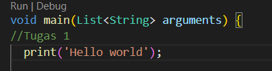
Jawaban : 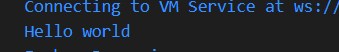
Penjelasan : untuk mencetak atau menampilkan teks "Hello world".

# Tugas2
Soal : 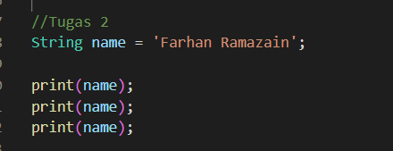
Jawaban : 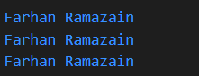
Penjelasan : untuk mencetak atau menampilkan teks "Farhan Ramazain" dan untuk 'print(name) Tiga baris ini mencetak nilai dari variabel name ke layar sebanyak tiga kali berturut-turut.

# Tugas3
Soal : 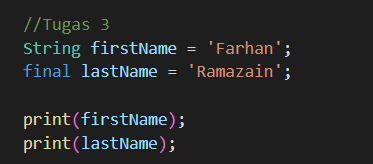
Jawaban : 
Penjelasan : final lastName = 'Ramazain';: Ini adalah pernyataan untuk mendefinisikan variabel dengan nama lastName yang diberi modifier final. Dalam bahasa Dart, penggunaan final mengindikasikan bahwa variabel ini hanya dapat diinisialisasi sekali dan nilainya tidak dapat diubah setelah inisialisasi. Variabel lastName juga diinisialisasi dengan nilai 'Ramazain'.

# Tugas 4
Soal : 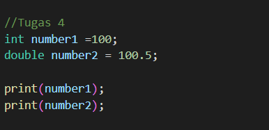
Jawaban : 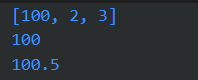
Penjelasan:Kode berikut mendeklarasikan dua variabel array dengan tipe data List. Kemudian, kode tersebut mengubah nilai elemen pertama dari kedua array tersebut menjadi 100.

# Tugas 5
Soal : 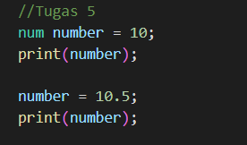
Jawaban : 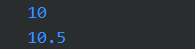
Penjelasan:Kode berikut mendeklarasikan variabel number dengan tipe data num. Kemudian, kode tersebut mengubah nilai variabel number dari 10 menjadi 10.5

# Tugas 6
Soal : 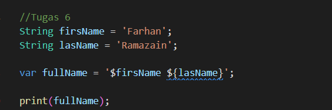
Jawaban : 
Penjelasan:Kode berikut mendeklarasikan dua variabel firsName dan lasName dengan tipe data String. Kemudian, kode tersebut menggunakan operator + untuk menggabungkan nilai kedua variabel tersebut menjadi satu variabel array dengan tipe data String

# Tugas 7
Soal : 
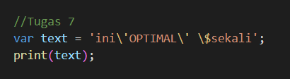
Jawaban : 
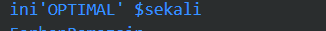
Penjelasan:kode terebut untuk mendefinisikan variabel text. Dalam Dart, Anda dapat menggunakan tanda kutip tunggal (') untuk mendefinisikan string, tetapi jika Anda ingin menyertakan karakter tanda kutip tunggal di dalam string, Anda perlu menghindarinya dengan menggabungkannya dengan karakter escape (\). Jadi, di dalam string 'ini\'OPTIMAL\' \$sekali', karakter escape (\) digunakan sebelum tanda kutip tunggal (') untuk menghindarinya dan membuat string yang berisi 'OPTIMAL' di dalamnya. Selain itu, karakter escape \$ digunakan sebelum tanda dolar ($) untuk mengeksekusi interpolasi string, yaitu menggantikan $sekali dengan nilai yang sesuai.

# Tugas 8
Soal : 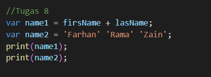
Jawaban : 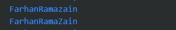
Penjelasan:Kode berikut mendeklarasikan dua variabel name1 dan name2 dengan tipe data String. Kemudian, kode tersebut menggunakan operator + untuk menggabungkan nilai kedua variabel tersebut menjadi satu variabel array dengan tipe data String.

# Tugas 9
Soal : 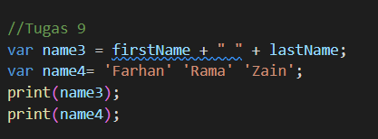
Jawaban : 
Penjelasan:Kode berikut mendeklarasikan dua variabel name3 dan name4 dengan tipe data String. Kemudian, kode tersebut menggunakan operator + untuk menggabungkan nilai kedua variabel tersebut menjadi satu variabel array dengan tipe data String.

# Tugas 10
Soal : 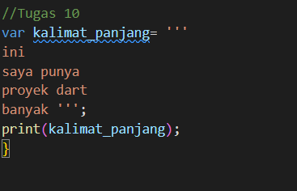
Jawaban : 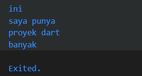
Penjelasan:Kode program tersebut untuk mendefinisikan sebuah variabel yang bernama kalimat_panjang. Variabel ini berisi sebuah string yang menggunakan tiga tanda kutip tunggal (''') untuk membungkus teksnya. Penggunaan tiga tanda kutip tunggal memungkinkan Anda untuk membuat string multi-baris (multiline string), yang berarti Anda dapat menulis beberapa baris teks dalam satu variabel string.
